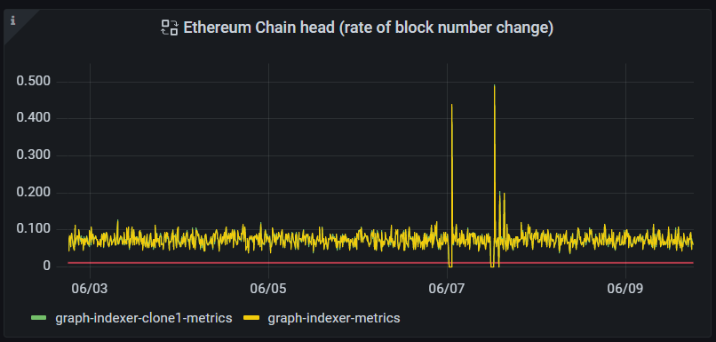
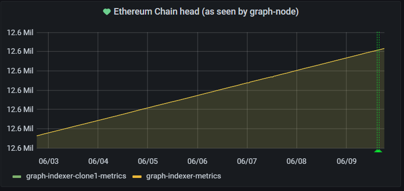

## Contributor Details
This documentation was contributed by Jim Cousins at [wavefive.co](https://wavefive.co/). Wavefive provides consulting and active governance participation in Web3 and runs a Graph Indexing service since the original Graph testnet, "Mission Control."

# Local Ethereum Node Monitoring

### Summary

Monitoring the state of your Ethereum archive nodes, used by your Graph Protocol infrastructure, is extremely important. If your Ethereum nodes stop ingesting blocks, your entire Graph operation will cease to Index and you will quickly lose query business as your deployment begins to fall behind the chainhead. If you aren't monitoring the state of the chainhead on your nodes, you may not even be aware of an issue until you have lost significant query business. There are a couple of identified ways to implement this monitoring, each with their own tradeoffs:

- Monitor the node to see what block it reports back as the chainhead. If that number does not change in a reasonable time, send an alert. This is a basic but useful method for monitoring your chainhead status without relying on any third parties.
- Monitor the node to see what block it reports back as the chainhead. Query third parties (Infura, Alchemy, Chainstack, Etherscan etc.) and monitor the difference between their chainhead and yours. Alert appropriately.

This guide covers the first method by using the `ethereum_chain_head_number` metric, which is explosed via the graph-node endpoint. 

### Pre-requisites

- Grafana deployment
- Prometheus with scrape job for graph-node metrics
- Prometheus collector configured as a Data Source in Grafana
- Grafana alerting pre-configured to send alerts in your preferred format and medium

### Configuration steps

You can install the required Grafana panel in a new dashboard, or add it to an existing dashboard - it's up to you.

If you know what you are doing with Grafana, you can import the following panel json and edit the data source to your own needs - [https://gist.github.com/cryptovestor21/0abc633e9c48b9549a2513ee9ed46a04](https://gist.github.com/cryptovestor21/0abc633e9c48b9549a2513ee9ed46a04)

To build the Grafana panel from scratch:

1. Create new panel on a dashboard
2. Add empty panel
3. Set the data source to your Prometheus collector and use a time series graph
4. Set the metric as `rate(ethereum_chain_head_number[5m])`
5. Set the legend as `{{job}}` and format as time series
6. Set the name of the panel as `Ethereum Chain head (rate of block number change) alert`
7. At this point if the metric is working, you should see data in the graph
8. Go to the alert tab and create a rule named `Ethereum Chain head (rate of block number change) alert`
9. Set the conditions to `WHEN avg OF query(A,5M,now) IS BELOW 0.001`
10. Set a notification message `Critical warning - Graph Ethereum archive nodes have fallen off the chainhead - check health of nodes immediately`
11. Set `sendto` according to your own alerting configuration.

You should now have a panel, with alerting for chainhead issues, that looks something like this:

The best way to test your alerting is to do so on testnet, by creating an eth node issue yourself (misconfiguration of the eth node in the graph-node config, for example) on a testnet deployment.

### Additional useful panel

You can create another chainhead monitoring panel to complement the one above - simply make a similar panel but use the basic metric `ethereum_chain_head_number` for a useful view of the chainhead, as seen by your graph-nodes:

